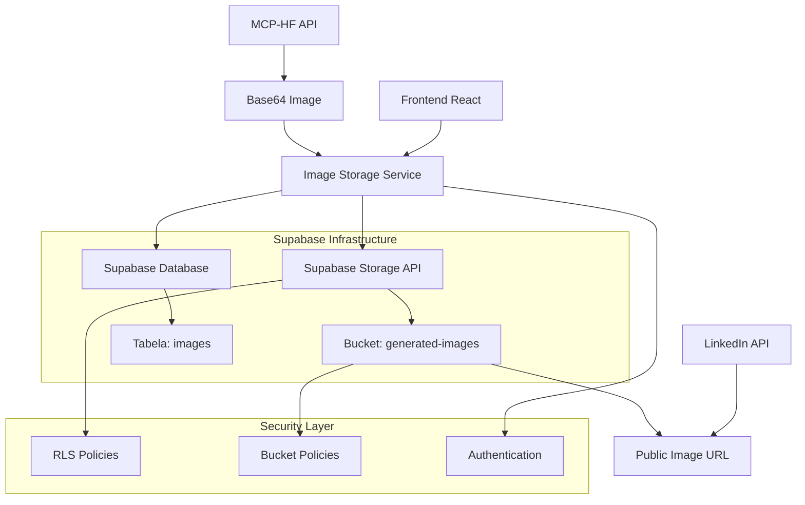

# Arquitetura Técnica - Supabase Storage

## 📋 Visão Geral

Este documento detalha a arquitetura técnica implementada para o sistema de armazenamento de imagens usando **Supabase Storage** no projeto LinkedIn Post Pilot.

---

## 🏗️ Arquitetura do Sistema

### **Diagrama de Arquitetura**



---

## 🔧 Componentes Técnicos

### **1. Image Storage Service**

**Localização:** `src/services/imageStorageService.ts`

#### **Interfaces TypeScript**
```typescript
interface UploadResult {
  success: boolean;
  url?: string;
  error?: string;
}

interface ImageMetadata {
  fileName: string;
  fileSize: number;
  mimeType: string;
  uploadedAt: string;
}
```

#### **Principais Métodos**

##### **uploadImageToSupabase()**
```typescript
async uploadImageToSupabase(
  base64Data: string, 
  fileName?: string
): Promise<string>
```

**Fluxo de Execução:**
1. Validação do formato base64
2. Extração do MIME type
3. Conversão para Blob
4. Geração de nome único
5. Upload para Supabase Storage
6. Retorno da URL pública

##### **base64ToBlob()**
```typescript
base64ToBlob(base64: string, mimeType: string): Blob
```

**Processo:**
1. Decodificação base64
2. Conversão para Uint8Array
3. Criação do Blob com MIME type correto

##### **generateUniqueFileName()**
```typescript
generateUniqueFileName(originalName?: string): string
```

**Formato:** `{timestamp}_{uuid}_{originalName}.{extension}`

---

### **2. Configuração do Storage**

#### **Bucket Configuration**
```sql
-- Criação do bucket
INSERT INTO storage.buckets (id, name, public, file_size_limit, allowed_mime_types)
VALUES (
  'generated-images',
  'generated-images',
  true,
  10485760, -- 10MB
  ARRAY['image/jpeg', 'image/png', 'image/webp']
);
```

#### **Políticas de Segurança**

##### **Upload Policy**
```sql
CREATE POLICY "Users can upload images" ON storage.objects
FOR INSERT TO authenticated
WITH CHECK (
  bucket_id = 'generated-images' AND
  auth.uid()::text = (storage.foldername(name))[1]
);
```

##### **Public Access Policy**
```sql
CREATE POLICY "Images are publicly viewable" ON storage.objects
FOR SELECT TO public
USING (bucket_id = 'generated-images');
```

---

## 🔒 Segurança e Controle de Acesso

### **Row Level Security (RLS)**

#### **Princípios Implementados:**
1. **Isolamento por Usuário:** Cada usuário só pode fazer upload em sua própria pasta
2. **Acesso Público para Leitura:** Imagens são publicamente visíveis via URL
3. **Autenticação Obrigatória:** Upload requer usuário autenticado
4. **Validação de Tipos:** Apenas formatos de imagem permitidos

#### **Estrutura de Pastas**
```
generated-images/
├── {user_id}/
│   ├── {timestamp}_{uuid}_image1.jpg
│   ├── {timestamp}_{uuid}_image2.png
│   └── ...
└── public/
    └── default-images/
```

### **Validações de Segurança**

#### **Client-Side**
```typescript
// Validação de tamanho
if (blob.size > 10 * 1024 * 1024) {
  throw new Error('Imagem muito grande (máximo 10MB)');
}

// Validação de tipo
const allowedTypes = ['image/jpeg', 'image/png', 'image/webp'];
if (!allowedTypes.includes(mimeType)) {
  throw new Error('Tipo de arquivo não permitido');
}
```

#### **Server-Side (Supabase)**
- Validação automática via bucket policies
- Limite de tamanho enforçado pelo Supabase
- Tipos MIME validados automaticamente

---

## 📊 Integração com Banco de Dados

### **Tabela: images**

```sql
CREATE TABLE images (
  id UUID PRIMARY KEY DEFAULT gen_random_uuid(),
  post_id UUID REFERENCES posts(id) ON DELETE CASCADE,
  url TEXT NOT NULL,
  prompt_used TEXT,
  ai_model TEXT,
  file_size INTEGER,
  storage_path TEXT, -- Novo campo para path no Storage
  created_at TIMESTAMP WITH TIME ZONE DEFAULT NOW()
);
```

### **Fluxo de Salvamento**

```typescript
// 1. Upload da imagem
const imageUrl = await uploadImageToSupabase(base64Data);

// 2. Salvamento no banco
const { data, error } = await supabase
  .from('images')
  .insert({
    post_id: postId,
    url: imageUrl,
    prompt_used: prompt,
    ai_model: 'flux-schnell',
    file_size: blob.size,
    storage_path: storagePath
  });
```

---

## ⚡ Performance e Otimização

### **Estratégias de Performance**

#### **1. Upload Otimizado**
```typescript
// Compressão automática para imagens grandes
if (blob.size > 5 * 1024 * 1024) {
  blob = await compressImage(blob, 0.8);
}

// Upload com retry automático
const uploadWithRetry = async (blob: Blob, retries = 3) => {
  for (let i = 0; i < retries; i++) {
    try {
      return await supabase.storage
        .from('generated-images')
        .upload(path, blob);
    } catch (error) {
      if (i === retries - 1) throw error;
      await new Promise(resolve => setTimeout(resolve, 1000 * (i + 1)));
    }
  }
};
```

#### **2. Cache Strategy**
```typescript
// Cache local para URLs recentes
const imageCache = new Map<string, string>();

const getCachedImageUrl = (imageId: string): string | null => {
  return imageCache.get(imageId) || null;
};

const setCachedImageUrl = (imageId: string, url: string): void => {
  imageCache.set(imageId, url);
  // Limpar cache após 1 hora
  setTimeout(() => imageCache.delete(imageId), 3600000);
};
```

#### **3. Lazy Loading**
```typescript
// Componente de imagem otimizado
const OptimizedImage: React.FC<{src: string}> = ({ src }) => {
  const [loaded, setLoaded] = useState(false);
  const [error, setError] = useState(false);
  
  return (
    <div className="relative">
      {!loaded && !error && <ImageSkeleton />}
       setLoaded(true)}
        onError={() => setError(true)}
        className={`transition-opacity ${loaded ? 'opacity-100' : 'opacity-0'}`}
        loading="lazy"
      />
      {error && <ImageErrorFallback />}
    </div>
  );
};
```

---

## 🔄 Tratamento de Erros

### **Hierarquia de Fallbacks**

```typescript
const uploadImageWithFallback = async (base64Data: string) => {
  try {
    // 1. Tentar upload para Supabase Storage
    return await uploadImageToSupabase(base64Data);
  } catch (storageError) {
    console.warn('Supabase Storage falhou:', storageError);
    
    try {
      // 2. Fallback: salvar no localStorage
      const dataUrl = `data:image/jpeg;base64,${base64Data}`;
      localStorage.setItem(`temp_image_${Date.now()}`, dataUrl);
      return dataUrl;
    } catch (localError) {
      console.warn('localStorage falhou:', localError);
      
      // 3. Último recurso: download direto
      downloadImageDirectly(base64Data);
      throw new Error('Não foi possível salvar a imagem');
    }
  }
};
```

### **Tipos de Erro e Tratamento**

| Erro | Causa | Tratamento |
|------|-------|------------|
| `NetworkError` | Conexão instável | Retry automático |
| `QuotaExceededError` | Limite de storage | Limpeza de cache |
| `AuthenticationError` | Token expirado | Refresh automático |
| `ValidationError` | Arquivo inválido | Mensagem específica |
| `SizeError` | Arquivo muito grande | Compressão automática |

---

## 📈 Monitoramento e Métricas

### **Métricas Coletadas**

```typescript
interface StorageMetrics {
  totalUploads: number;
  successRate: number;
  averageUploadTime: number;
  totalStorageUsed: number;
  errorsByType: Record<string, number>;
}

// Coleta de métricas
const trackUploadMetrics = (startTime: number, success: boolean, error?: string) => {
  const uploadTime = Date.now() - startTime;
  
  // Enviar para analytics
  analytics.track('image_upload', {
    success,
    uploadTime,
    error: error || null,
    timestamp: new Date().toISOString()
  });
};
```

### **Dashboard de Monitoramento**

```sql
-- Query para métricas de uso
SELECT 
  DATE_TRUNC('day', created_at) as date,
  COUNT(*) as uploads_count,
  AVG(file_size) as avg_file_size,
  SUM(file_size) as total_size
FROM images 
WHERE created_at >= NOW() - INTERVAL '30 days'
GROUP BY DATE_TRUNC('day', created_at)
ORDER BY date DESC;
```

---

## 🧪 Testes e Validação

### **Testes Unitários**

```typescript
describe('ImageStorageService', () => {
  test('deve converter base64 para blob corretamente', () => {
    const base64 = 'data:image/jpeg;base64,/9j/4AAQSkZJRgABAQAAAQ...';
    const blob = base64ToBlob(base64, 'image/jpeg');
    
    expect(blob.type).toBe('image/jpeg');
    expect(blob.size).toBeGreaterThan(0);
  });
  
  test('deve gerar nome único para arquivo', () => {
    const name1 = generateUniqueFileName('test.jpg');
    const name2 = generateUniqueFileName('test.jpg');
    
    expect(name1).not.toBe(name2);
    expect(name1).toMatch(/\d+_[a-f0-9-]+_test\.jpg/);
  });
});
```

### **Testes de Integração**

```typescript
describe('Supabase Storage Integration', () => {
  test('deve fazer upload e retornar URL pública', async () => {
    const mockBase64 = 'data:image/jpeg;base64,/9j/4AAQSkZJRgABAQAAAQ...';
    
    const url = await uploadImageToSupabase(mockBase64);
    
    expect(url).toMatch(/https:\/\/.*\.supabase\.co\/storage\/v1\/object\/public\//);
    
    // Verificar se a imagem é acessível
    const response = await fetch(url);
    expect(response.ok).toBe(true);
  });
});
```

---

## 🔮 Roadmap Técnico

### **Próximas Implementações**

#### **Q1 2025**
- [ ] **Compressão Inteligente:** Algoritmo adaptativo baseado no conteúdo
- [ ] **CDN Personalizado:** Integração com CloudFlare para melhor performance
- [ ] **Thumbnails Automáticos:** Geração de múltiplos tamanhos

#### **Q2 2025**
- [ ] **Análise de Conteúdo:** IA para detectar conteúdo inadequado
- [ ] **Watermark Dinâmico:** Marca d'água personalizada por usuário
- [ ] **Backup Redundante:** Múltiplas regiões para alta disponibilidade

#### **Q3 2025**
- [ ] **Edge Computing:** Processamento de imagem no edge
- [ ] **ML Pipeline:** Pipeline de machine learning para otimização
- [ ] **Real-time Sync:** Sincronização em tempo real entre dispositivos

---

## 📚 Referências Técnicas

### **Documentação**
- [Supabase Storage API](https://supabase.com/docs/reference/javascript/storage)
- [Row Level Security](https://supabase.com/docs/guides/auth/row-level-security)
- [Storage Policies](https://supabase.com/docs/guides/storage/security/access-control)

### **Bibliotecas Utilizadas**
- `@supabase/supabase-js`: Cliente oficial do Supabase
- `uuid`: Geração de identificadores únicos
- `mime-types`: Detecção de tipos MIME

### **Padrões Seguidos**
- **REST API:** Padrões RESTful para endpoints
- **TypeScript:** Tipagem forte para maior segurança
- **Error Handling:** Padrão de tratamento de erros consistente
- **Security First:** Segurança como prioridade em todas as implementações

---

**Versão da Arquitetura:** 2.0.0  
**Última Atualização:** Janeiro 2025  
**Status:** ✅ Implementado e Testado