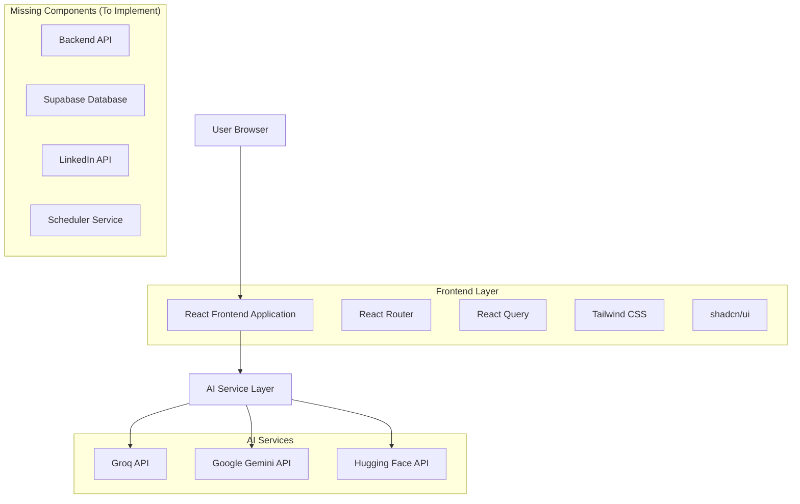
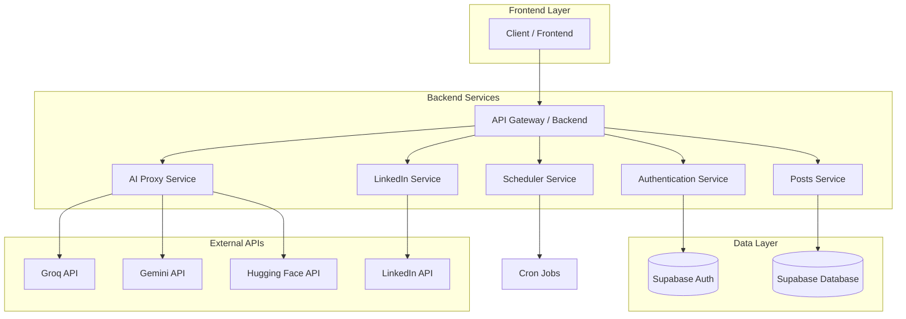
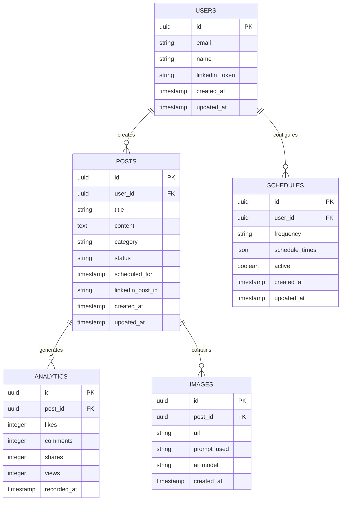

# Arquitetura Técnica - LinkedIn Post Pilot

## 1. Arquitetura Atual



## 2. Tecnologias Utilizadas

### Frontend
- **React**: 18.3.1 + TypeScript
- **Build Tool**: Vite 5.4.1
- **Styling**: Tailwind CSS 3.4.11 + tailwindcss-animate
- **UI Components**: Radix UI + shadcn/ui
- **Routing**: React Router DOM 6.26.2
- **State Management**: TanStack React Query 5.56.2
- **Forms**: React Hook Form 7.53.0 + Zod 3.23.8
- **Icons**: Lucide React 0.462.0
- **Themes**: next-themes 0.3.0

### Backend (Proposto)
- **Database**: Supabase (PostgreSQL)
- **Authentication**: Supabase Auth
- **File Storage**: Supabase Storage
- **API**: Supabase Edge Functions ou Express.js

## 3. Definições de Rotas

| Rota | Propósito |
|------|----------|
| / | Página inicial (LandingPage) com hero section e features |
| /dashboard | Dashboard principal com métricas e status |
| /posts | Gerenciamento de posts (criar, editar, agendar) |
| /settings | Configurações da aplicação e APIs |
| /support | Página de suporte e documentação |
| * | Página 404 (NotFound) |

## 4. Definições de API (Propostas)

### 4.1 APIs de IA (Atuais)

#### Groq API
```typescript
POST https://api.groq.com/openai/v1/chat/completions
```

**Request:**
| Param | Type | Required | Description |
|-------|------|----------|-------------|
| model | string | true | llama-3.3-70b-versatile |
| messages | array | true | Array de mensagens do chat |
| max_tokens | number | false | Máximo de tokens (padrão: 500) |
| temperature | number | false | Criatividade (padrão: 0.7) |

**Response:**
| Param | Type | Description |
|-------|------|-------------|
| choices | array | Array com as respostas geradas |
| usage | object | Informações de uso de tokens |

#### Hugging Face API
```typescript
POST https://api-inference.huggingface.co/models/stabilityai/stable-diffusion-xl-base-1.0
```

**Request:**
| Param | Type | Required | Description |
|-------|------|----------|-------------|
| inputs | string | true | Prompt para geração da imagem |
| parameters | object | false | Parâmetros de geração |

**Response:**
- Blob da imagem gerada

### 4.2 APIs Backend (A Implementar)

#### Autenticação
```typescript
POST /api/auth/login
POST /api/auth/logout
GET /api/auth/profile
```

#### Posts
```typescript
GET /api/posts
POST /api/posts
PUT /api/posts/:id
DELETE /api/posts/:id
POST /api/posts/:id/publish
```

#### IA Services (Proxy)
```typescript
POST /api/ai/generate-content
POST /api/ai/generate-image
POST /api/ai/improve-content
POST /api/ai/generate-hashtags
```

#### LinkedIn Integration
```typescript
GET /api/linkedin/auth
POST /api/linkedin/publish
GET /api/linkedin/profile
```

#### Agendamento
```typescript
GET /api/schedule
POST /api/schedule
PUT /api/schedule/:id
DELETE /api/schedule/:id
```

## 5. Arquitetura Proposta (Completa)



## 6. Modelo de Dados

### 6.1 Diagrama ER



### 6.2 DDL (Data Definition Language)

```sql
-- Tabela de usuários (usando Supabase Auth)
CREATE TABLE users (
    id UUID PRIMARY KEY DEFAULT gen_random_uuid(),
    email VARCHAR(255) UNIQUE NOT NULL,
    name VARCHAR(100) NOT NULL,
    linkedin_token TEXT,
    linkedin_profile_id VARCHAR(100),
    created_at TIMESTAMP WITH TIME ZONE DEFAULT NOW(),
    updated_at TIMESTAMP WITH TIME ZONE DEFAULT NOW()
);

-- Tabela de posts
CREATE TABLE posts (
    id UUID PRIMARY KEY DEFAULT gen_random_uuid(),
    user_id UUID REFERENCES users(id) ON DELETE CASCADE,
    title VARCHAR(255) NOT NULL,
    content TEXT NOT NULL,
    category VARCHAR(50) NOT NULL,
    status VARCHAR(20) DEFAULT 'draft' CHECK (status IN ('draft', 'scheduled', 'published', 'failed')),
    scheduled_for TIMESTAMP WITH TIME ZONE,
    linkedin_post_id VARCHAR(100),
    ai_generated BOOLEAN DEFAULT false,
    ai_topic TEXT,
    created_at TIMESTAMP WITH TIME ZONE DEFAULT NOW(),
    updated_at TIMESTAMP WITH TIME ZONE DEFAULT NOW()
);

-- Tabela de imagens
CREATE TABLE images (
    id UUID PRIMARY KEY DEFAULT gen_random_uuid(),
    post_id UUID REFERENCES posts(id) ON DELETE CASCADE,
    url TEXT NOT NULL,
    prompt_used TEXT,
    ai_model VARCHAR(50),
    file_size INTEGER,
    created_at TIMESTAMP WITH TIME ZONE DEFAULT NOW()
);

-- Tabela de agendamentos
CREATE TABLE schedules (
    id UUID PRIMARY KEY DEFAULT gen_random_uuid(),
    user_id UUID REFERENCES users(id) ON DELETE CASCADE,
    frequency VARCHAR(20) DEFAULT 'daily' CHECK (frequency IN ('daily', 'weekly', 'custom')),
    schedule_times JSON NOT NULL, -- ["09:00", "14:00", "18:00"]
    active BOOLEAN DEFAULT true,
    last_run TIMESTAMP WITH TIME ZONE,
    created_at TIMESTAMP WITH TIME ZONE DEFAULT NOW(),
    updated_at TIMESTAMP WITH TIME ZONE DEFAULT NOW()
);

-- Tabela de analytics
CREATE TABLE analytics (
    id UUID PRIMARY KEY DEFAULT gen_random_uuid(),
    post_id UUID REFERENCES posts(id) ON DELETE CASCADE,
    likes INTEGER DEFAULT 0,
    comments INTEGER DEFAULT 0,
    shares INTEGER DEFAULT 0,
    views INTEGER DEFAULT 0,
    recorded_at TIMESTAMP WITH TIME ZONE DEFAULT NOW()
);

-- Índices para performance
CREATE INDEX idx_posts_user_id ON posts(user_id);
CREATE INDEX idx_posts_status ON posts(status);
CREATE INDEX idx_posts_scheduled_for ON posts(scheduled_for);
CREATE INDEX idx_analytics_post_id ON analytics(post_id);
CREATE INDEX idx_analytics_recorded_at ON analytics(recorded_at DESC);

-- RLS (Row Level Security) para Supabase
ALTER TABLE users ENABLE ROW LEVEL SECURITY;
ALTER TABLE posts ENABLE ROW LEVEL SECURITY;
ALTER TABLE images ENABLE ROW LEVEL SECURITY;
ALTER TABLE schedules ENABLE ROW LEVEL SECURITY;
ALTER TABLE analytics ENABLE ROW LEVEL SECURITY;

-- Políticas de segurança
CREATE POLICY "Users can view own data" ON users FOR SELECT USING (auth.uid() = id);
CREATE POLICY "Users can update own data" ON users FOR UPDATE USING (auth.uid() = id);

CREATE POLICY "Users can manage own posts" ON posts FOR ALL USING (auth.uid() = user_id);
CREATE POLICY "Users can manage own images" ON images FOR ALL USING (
    auth.uid() = (SELECT user_id FROM posts WHERE posts.id = images.post_id)
);
CREATE POLICY "Users can manage own schedules" ON schedules FOR ALL USING (auth.uid() = user_id);
CREATE POLICY "Users can view own analytics" ON analytics FOR SELECT USING (
    auth.uid() = (SELECT user_id FROM posts WHERE posts.id = analytics.post_id)
);

-- Dados iniciais para desenvolvimento
INSERT INTO users (id, email, name) VALUES 
('550e8400-e29b-41d4-a716-446655440000', 'demo@example.com', 'Demo User');

INSERT INTO posts (user_id, title, content, category, status) VALUES 
('550e8400-e29b-41d4-a716-446655440000', 'Tendências em Data Science 2024', 'A inteligência artificial está moldando o futuro...', 'tecnologia', 'published'),
('550e8400-e29b-41d4-a716-446655440000', 'Machine Learning na Prática', 'Como aplicar machine learning em projetos reais...', 'educacao', 'scheduled');
```

## 7. Configuração de Ambiente

### 7.1 Gerenciamento de Segredos com Doppler

**⚠️ IMPORTANTE: Este projeto usa Doppler para gerenciar segredos de forma segura. Nunca use arquivos .env!**

```bash
# Configuração inicial do Doppler
doppler login
doppler setup
# Selecione: linkedin-post-pilot
# Ambiente: dev

# Configurar variáveis no Doppler
# Frontend
doppler secrets set VITE_SUPABASE_URL="https://your-project.supabase.co"
doppler secrets set VITE_SUPABASE_ANON_KEY="your-anon-key"

# Backend (Edge Functions)
doppler secrets set SUPABASE_URL="https://your-project.supabase.co"
doppler secrets set SUPABASE_ANON_KEY="your-anon-key"
doppler secrets set SUPABASE_SERVICE_ROLE_KEY="your-service-role-key"

# APIs de IA
doppler secrets set GROQ_API_KEY="gsk_your_groq_key"
doppler secrets set GEMINI_API_KEY="your_gemini_key"
doppler secrets set HUGGINGFACE_API_KEY="hf_your_token"

# LinkedIn OAuth
doppler secrets set LINKEDIN_CLIENT_ID="your_linkedin_client_id"
doppler secrets set LINKEDIN_CLIENT_SECRET="your_linkedin_client_secret"
doppler secrets set LINKEDIN_REDIRECT_URI="http://localhost:8080/auth/linkedin/callback"

# Outros
doppler secrets set JWT_SECRET="your-jwt-secret"
doppler secrets set NODE_ENV="development"
```

### 7.2 Scripts de Deploy

```json
{
  "scripts": {
    "dev": "vite",
    "dev:doppler": "doppler run -- vite",
    "build": "vite build",
    "build:doppler": "doppler run -- vite build",
    "preview": "vite preview",
    "preview:doppler": "doppler run -- vite preview",
    "deploy:frontend": "doppler run -- npm run build && vercel --prod",
    "deploy:db": "doppler run -- supabase db push",
    "supabase:start": "doppler run -- supabase start",
    "supabase:stop": "doppler run -- supabase stop",
    "supabase:reset": "doppler run -- supabase db reset"
  }
}
```

## 8. Segurança e Performance

### 8.1 Medidas de Segurança
- **Doppler** para gerenciamento seguro de segredos
- **Row Level Security (RLS)** no Supabase
- **Chaves API no backend** apenas (Edge Functions)
- **Rate limiting** nas APIs
- **Validação de entrada** com Zod
- **CORS** configurado adequadamente
- **HTTPS** obrigatório em produção
- **Nunca usar arquivos .env** em produção

### 8.2 Otimizações de Performance
- **React Query** para cache de dados
- **Lazy loading** de componentes
- **Otimização de imagens** (WebP, compressão)
- **Bundle splitting** com Vite
- **CDN** para assets estáticos
- **Database indexing** adequado

## 9. Monitoramento e Logs

### 9.1 Ferramentas Sugeridas
- **Sentry** - Error tracking
- **Vercel Analytics** - Performance monitoring
- **Supabase Dashboard** - Database monitoring
- **Console logs** estruturados

### 9.2 Métricas Importantes
- **Tempo de resposta** das APIs de IA
- **Taxa de sucesso** na publicação
- **Uso de tokens** das APIs
- **Engajamento** dos posts
- **Uptime** da aplicação

## 10. Plano de Migração

### Fase 1: Setup Backend
1. Configurar projeto Supabase
2. Criar tabelas e políticas
3. Implementar autenticação

### Fase 2: API Proxy
1. Mover chaves API para backend
2. Criar endpoints proxy
3. Implementar rate limiting

### Fase 3: LinkedIn Integration
1. Configurar OAuth
2. Implementar publicação
3. Sincronizar dados

### Fase 4: Scheduler
1. Implementar cron jobs
2. Criar fila de processamento
3. Adicionar retry logic

Esta arquitetura garante **escalabilidade**, **segurança** e **manutenibilidade** para o LinkedIn Post Pilot.