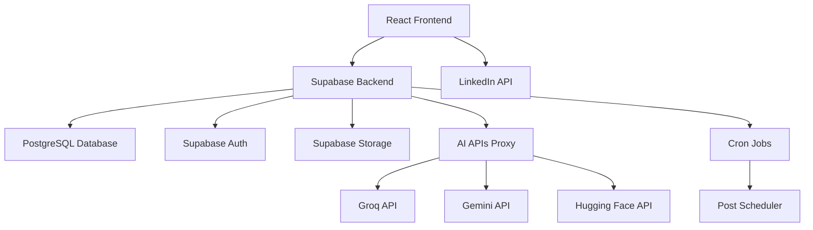

# Plano de Implementação - LinkedIn Post Pilot

## 1. Resumo Executivo

Este documento detalha o plano de implementação para finalizar o LinkedIn Post Pilot, uma plataforma de automação de posts para LinkedIn com IA integrada. O projeto está 40% concluído, com interface funcional e integração IA básica implementadas.

**Status Atual**: MVP parcial com geração de conteúdo IA
**Objetivo**: Aplicação completa com integração LinkedIn e agendamento
**Prazo**: 12 semanas (3 fases)
**Investimento**: Médio (APIs, infraestrutura, desenvolvimento)

## 2. Análise da Situação Atual

### 2.1 ✅ Funcionalidades Implementadas

| Componente        | Status      | Qualidade | Observações                   |
| ----------------- | ----------- | --------- | ----------------------------- |
| Interface React   | ✅ Completo  | Alta      | Tailwind CSS + shadcn/ui      |
| Geração Texto IA  | ✅ Funcional | Alta      | Groq + Gemini integrados      |
| Geração Imagem IA | ✅ Funcional | Média     | Hugging Face Stable Diffusion |
| Roteamento        | ✅ Completo  | Alta      | React Router implementado     |
| Componentes UI    | ✅ Completo  | Alta      | Design system consistente     |
| Responsividade    | ✅ Completo  | Alta      | Mobile-first approach         |

### 2.2 ❌ Funcionalidades Pendentes

| Componente              | Prioridade | Complexidade | Impacto      |
| ----------------------- | ---------- | ------------ | ------------ |
| Integração LinkedIn API | 🔴 Crítica | Alta         | Bloqueante   |
| Sistema de Usuários     | 🔴 Crítica | Média        | Bloqueante   |
| Agendamento Posts       | 🟡 Alta    | Alta         | Core feature |
| Analytics LinkedIn      | 🟡 Alta    | Média        | Diferencial  |
| Persistência Dados      | 🔴 Crítica | Baixa        | Bloqueante   |
| Sistema Notificações    | 🟢 Média   | Baixa        | Nice to have |

### 2.3 🔧 Problemas Identificados

1. **Segurança**: Chaves API expostas no frontend
2. **Performance**: Sem cache para requisições IA
3. **UX**: Falta feedback visual durante operações
4. **Dados**: Sem persistência, dados perdidos no refresh
5. **Monitoramento**: Sem logs ou error tracking

## 3. Arquitetura de Implementação

### 3.1 Stack Tecnológico Final

### 3.2 Decisões Arquiteturais

| Decisão                 | Justificativa                              | Alternativa Rejeitada |
| ----------------------- | ------------------------------------------ | --------------------- |
| Supabase como Backend   | Rapidez de desenvolvimento, Auth integrado | Node.js + Express     |
| Manter React Frontend   | Já implementado, boa qualidade             | Reescrever em Next.js |
| Proxy APIs no Backend   | Segurança das chaves                       | Manter no frontend    |
| PostgreSQL via Supabase | Relacional, JSON support                   | MongoDB               |
| Vercel para Deploy      | Integração com React, CDN                  | AWS/Azure             |

## 4. Fases de Implementação

### 📋 Fase 1: Fundação Backend (Semanas 1-4)

#### Objetivos

* Configurar infraestrutura Supabase

* Implementar autenticação

* Migrar APIs IA para backend

* Implementar persistência básica

#### Tarefas Detalhadas

**Semana 1: Setup Supabase**

* [ ] Criar projeto Supabase

* [ ] Configurar database schema

* [ ] Implementar Row Level Security (RLS)

* [ ] Configurar variáveis de ambiente

* [ ] Testar conexão frontend-backend

**Semana 2: Sistema de Autenticação**

* [ ] Configurar Supabase Auth

* [ ] Implementar login/registro no frontend

* [ ] Criar middleware de autenticação

* [ ] Implementar proteção de rotas

* [ ] Testar fluxo completo de auth

**Semana 3: Proxy APIs IA**

* [ ] Criar Edge Functions no Supabase

* [ ] Migrar chamadas Groq para backend

* [ ] Migrar chamadas Gemini para backend

* [ ] Migrar chamadas Hugging Face para backend

* [ ] Implementar rate limiting

* [ ] Atualizar frontend para usar proxy

**Semana 4: Persistência de Dados**

* [ ] Implementar CRUD de posts

* [ ] Implementar upload de imagens

* [ ] Criar sistema de categorias

* [ ] Implementar histórico de posts

* [ ] Testes de integração

#### Critérios de Aceitação Fase 1

* ✅ Usuários podem se registrar e fazer login

* ✅ Posts são salvos no banco de dados

* ✅ APIs IA funcionam via backend

* ✅ Imagens são armazenadas no Supabase Storage

* ✅ Interface atualizada para usar dados persistentes

### 🔗 Fase 2: Integração LinkedIn (Semanas 5-8)

#### Objetivos

* Implementar OAuth LinkedIn

* Desenvolver publicação automática

* Criar sistema de agendamento

* Implementar analytics básicos

#### Tarefas Detalhadas

**Semana 5: OAuth LinkedIn**

* [ ] Registrar aplicação no LinkedIn Developer

* [ ] Implementar fluxo OAuth 2.0

* [ ] Armazenar tokens de acesso

* [ ] Implementar refresh de tokens

* [ ] Testar autenticação LinkedIn

**Semana 6: Publicação LinkedIn**

* [ ] Implementar LinkedIn Share API

* [ ] Criar função de publicação de texto

* [ ] Implementar upload de imagens

* [ ] Adicionar validação de conteúdo

* [ ] Implementar retry logic

**Semana 7: Sistema de Agendamento**

* [ ] Criar tabela de agendamentos

* [ ] Implementar cron jobs

* [ ] Desenvolver interface de agendamento

* [ ] Implementar fila de processamento

* [ ] Adicionar notificações de status

**Semana 8: Analytics Básicos**

* [ ] Integrar LinkedIn Analytics API

* [ ] Criar dashboard de métricas

* [ ] Implementar coleta de dados

* [ ] Desenvolver relatórios básicos

* [ ] Testes de integração completa

#### Critérios de Aceitação Fase 2

* ✅ Usuários conectam conta LinkedIn

* ✅ Posts são publicados automaticamente

* ✅ Agendamento funciona corretamente

* ✅ Métricas básicas são coletadas

* ✅ Interface reflete status real dos posts

### 🚀 Fase 3: Otimização e Lançamento (Semanas 9-12)

#### Objetivos

* Implementar funcionalidades avançadas

* Otimizar performance

* Preparar para produção

* Lançar versão beta

#### Tarefas Detalhadas

**Semana 9: Funcionalidades Avançadas**

* [ ] Implementar templates de posts

* [ ] Criar sistema de hashtags inteligentes

* [ ] Desenvolver preview de posts

* [ ] Implementar A/B testing básico

* [ ] Adicionar configurações avançadas

**Semana 10: Performance e UX**

* [ ] Implementar cache inteligente

* [ ] Otimizar queries do banco

* [ ] Adicionar loading states

* [ ] Implementar error boundaries

* [ ] Melhorar responsividade

**Semana 11: Produção e Monitoramento**

* [ ] Configurar ambiente de produção

* [ ] Implementar logging estruturado

* [ ] Configurar error tracking (Sentry)

* [ ] Implementar health checks

* [ ] Configurar backups automáticos

**Semana 12: Lançamento Beta**

* [ ] Testes finais de integração

* [ ] Documentação de usuário

* [ ] Configurar analytics de produto

* [ ] Lançar para usuários beta

* [ ] Coletar feedback inicial

#### Critérios de Aceitação Fase 3

* ✅ Aplicação estável em produção

* ✅ Performance otimizada (< 3s load time)

* ✅ Monitoramento ativo

* ✅ Documentação completa

* ✅ Feedback positivo dos beta users

## 5. Recursos Necessários

### 5.1 Equipe

| Papel                    | Dedicação | Responsabilidades                      |
| ------------------------ | --------- | -------------------------------------- |
| Desenvolvedor Full-Stack | 100%      | Implementação backend, integração APIs |
| Desenvolvedor Frontend   | 50%       | Melhorias UI/UX, testes                |
| DevOps/Infra             | 25%       | Deploy, monitoramento, segurança       |
| Product Owner            | 25%       | Validação, testes, documentação        |

### 5.2 Infraestrutura

| Serviço      | Custo Mensal | Justificativa           |
| ------------ | ------------ | ----------------------- |
| Supabase Pro | $25          | Database, Auth, Storage |
| Vercel Pro   | $20          | Frontend hosting, CDN   |
| LinkedIn API | Gratuito     | Até 500 requests/day    |
| Groq API     | $20          | Geração de texto IA     |
| Gemini API   | $15          | Backup para Groq        |
| Hugging Face | $10          | Geração de imagens      |
| Sentry       | $26          | Error tracking          |
| **Total**    | **$116/mês** | Escalável conforme uso  |

### 5.3 Ferramentas de Desenvolvimento

* **IDE**: VS Code com extensões React/TypeScript

* **Versionamento**: Git + GitHub

* **CI/CD**: GitHub Actions + Vercel

* **Testing**: Vitest + React Testing Library

* **API Testing**: Postman/Insomnia

* **Design**: Figma (se necessário)

## 6. Riscos e Mitigações

### 6.1 Riscos Técnicos

| Risco                 | Probabilidade | Impacto | Mitigação                    |
| --------------------- | ------------- | ------- | ---------------------------- |
| LinkedIn API mudanças | Média         | Alto    | Monitoramento, versioning    |
| Rate limits APIs IA   | Alta          | Médio   | Fallback, cache, retry       |
| Performance Supabase  | Baixa         | Alto    | Otimização queries, cache    |
| Bugs em produção      | Média         | Médio   | Testes, monitoring, rollback |

### 6.2 Riscos de Cronograma

| Risco                       | Probabilidade | Impacto | Mitigação                   |
| --------------------------- | ------------- | ------- | --------------------------- |
| Complexidade LinkedIn OAuth | Alta          | Alto    | Prototipagem antecipada     |
| Integração APIs complexa    | Média         | Médio   | Desenvolvimento incremental |
| Testes insuficientes        | Média         | Alto    | TDD, automação              |
| Scope creep                 | Alta          | Alto    | Priorização rigorosa        |

### 6.3 Riscos de Negócio

| Risco                 | Probabilidade | Impacto | Mitigação                 |
| --------------------- | ------------- | ------- | ------------------------- |
| Concorrência          | Alta          | Médio   | Diferenciação via IA      |
| Mudanças LinkedIn ToS | Baixa         | Alto    | Compliance, alternativas  |
| Baixa adoção          | Média         | Alto    | MVP, feedback rápido      |
| Custos APIs           | Média         | Médio   | Monitoramento, otimização |

## 7. Métricas de Sucesso

### 7.1 Métricas Técnicas

| Métrica        | Meta  | Medição                |
| -------------- | ----- | ---------------------- |
| Uptime         | 99.5% | Monitoring tools       |
| Response Time  | < 2s  | Performance monitoring |
| Error Rate     | < 1%  | Error tracking         |
| Test Coverage  | > 80% | Automated testing      |
| Security Score | A+    | Security audits        |

### 7.2 Métricas de Produto

| Métrica          | Meta  | Medição               |
| ---------------- | ----- | --------------------- |
| Usuários Ativos  | 100+  | Analytics             |
| Posts Publicados | 1000+ | Database metrics      |
| Taxa de Sucesso  | 95%   | Success/failure ratio |
| NPS              | > 50  | User surveys          |
| Retention Rate   | 70%   | User analytics        |

### 7.3 Métricas de Negócio

| Métrica                         | Meta    | Medição             |
| ------------------------------- | ------- | ------------------- |
| CAC (Customer Acquisition Cost) | < $50   | Marketing analytics |
| LTV (Lifetime Value)            | > $200  | Revenue tracking    |
| Churn Rate                      | < 10%   | User retention      |
| Revenue Growth                  | 20%/mês | Financial tracking  |
| Market Share                    | 1%      | Industry analysis   |

## 8. Plano de Contingência

### 8.1 Cenário: Atraso na Integração LinkedIn

**Impacto**: Atraso de 2-4 semanas no cronograma

**Ações**:

1. Priorizar funcionalidades core (geração IA)
2. Implementar publicação manual como workaround
3. Buscar desenvolvedores especializados
4. Considerar APIs alternativas (Buffer, Hootsuite)

### 8.2 Cenário: Problemas de Performance

**Impacto**: UX degradada, possível perda de usuários

**Ações**:

1. Implementar cache agressivo
2. Otimizar queries do banco
3. Usar CDN para assets
4. Considerar migração para Next.js

### 8.3 Cenário: Orçamento Insuficiente

**Impacto**: Limitação de recursos, funcionalidades reduzidas

**Ações**:

1. Priorizar MVP mínimo
2. Usar tiers gratuitos quando possível
3. Implementar monetização antecipada
4. Buscar investimento/parcerias

## 9. Próximos Passos Imediatos

### Semana Atual (Semana 0)

**Prioridade Máxima**:

1. ✅ **Configurar projeto Supabase** (2 dias)

   * Criar conta e projeto

   * Configurar database inicial

   * Testar conexão

2. ✅ **Implementar schema do banco** (1 dia)

   * Criar tabelas users, posts, images

   * Configurar RLS policies

   * Inserir dados de teste

3. ✅ **Migrar uma API IA** (2 dias)

   * Criar Edge Function para Groq

   * Atualizar frontend

   * Testar integração

**Entregáveis da Semana**:

* [ ] Supabase configurado e funcional

* [ ] Schema do banco implementado

* [ ] Uma API IA funcionando via backend

* [ ] Documentação de setup atualizada

### Validações Necessárias

Antes de prosseguir com a implementação:

1. **Validar LinkedIn Developer Account**

   * Verificar elegibilidade

   * Entender limitações da API

   * Confirmar custos

2. **Testar Performance APIs IA**

   * Medir tempos de resposta

   * Validar qualidade do output

   * Confirmar rate limits

3. **Validar Arquitetura Supabase**

   * Testar Edge Functions

   * Validar RLS policies

   * Confirmar escalabilidade

Este plano garante uma implementação estruturada e de baixo risco para finalizar o LinkedIn Post Pilot com sucesso.
