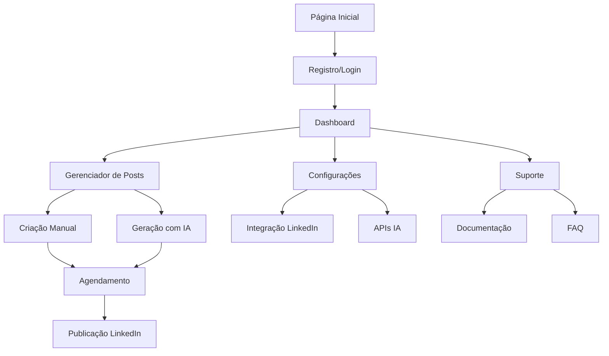

# Requisitos de Produto - LinkedIn Post Pilot

## 1. Visão Geral do Produto

O LinkedIn Post Pilot é uma plataforma de automação inteligente para criação e gerenciamento de posts no LinkedIn, utilizando IA para gerar conteúdo personalizado, imagens e otimizar o engajamento profissional.

A ferramenta resolve o problema da criação consistente de conteúdo de qualidade no LinkedIn, permitindo que profissionais e empresas mantenham presença ativa na rede sem dedicar horas diárias à criação manual de posts.

O produto visa capturar o mercado de criadores de conteúdo profissional, consultores, empresas de marketing digital e profissionais que buscam aumentar sua visibilidade no LinkedIn.

## 2. Funcionalidades Principais

### 2.1 Papéis de Usuário

| Papel | Método de Registro | Permissões Principais |
|-------|-------------------|----------------------|
| Usuário Gratuito | Email + senha | Gerar até 5 posts/mês, usar IA básica, visualizar analytics limitados |
| Usuário Premium | Upgrade via pagamento | Posts ilimitados, IA avançada, agendamento automático, analytics completos |
| Administrador | Acesso interno | Gerenciar usuários, monitorar sistema, configurar APIs |

### 2.2 Módulos de Funcionalidades

Nossa aplicação LinkedIn Post Pilot consiste nas seguintes páginas principais:

1. **Página Inicial**: seção hero, navegação principal, demonstração de recursos, depoimentos.
2. **Dashboard**: métricas de engajamento, posts recentes, status de automação, analytics.
3. **Gerenciador de Posts**: criação manual, geração com IA, edição, agendamento, histórico.
4. **Configurações**: integração LinkedIn, chaves API, preferências de automação, planos.
5. **Suporte**: documentação, FAQ, contato, tutoriais.

### 2.3 Detalhes das Páginas

| Nome da Página | Nome do Módulo | Descrição da Funcionalidade |
|----------------|----------------|-----------------------------|
| Página Inicial | Seção Hero | Apresentar valor da ferramenta com CTA claro, demonstração visual dos recursos |
| Página Inicial | Recursos | Exibir funcionalidades principais: IA, agendamento, analytics, integração LinkedIn |
| Página Inicial | Depoimentos | Mostrar casos de sucesso e feedback de usuários reais |
| Dashboard | Métricas Principais | Exibir KPIs: posts publicados, engajamento médio, alcance, crescimento de seguidores |
| Dashboard | Posts Recentes | Listar últimos posts com status, métricas individuais, ações rápidas |
| Dashboard | Status Automação | Mostrar configurações ativas, próximos posts agendados, alertas do sistema |
| Gerenciador Posts | Criação Manual | Formulário completo: título, conteúdo, categoria, hashtags, imagem, agendamento |
| Gerenciador Posts | Geração IA | Interface para gerar conteúdo: tópico, tom, categoria, geração de imagem, preview |
| Gerenciador Posts | Editor Avançado | Melhorar conteúdo existente, sugestões IA, otimização SEO, preview LinkedIn |
| Gerenciador Posts | Agendamento | Calendário visual, horários otimizados, fuso horário, recorrência |
| Gerenciador Posts | Histórico | Lista filtrada de posts, busca, analytics individuais, republicação |
| Configurações | Integração LinkedIn | OAuth, permissões, sincronização de perfil, teste de conexão |
| Configurações | APIs IA | Configurar chaves Groq, Gemini, Hugging Face, teste de conectividade |
| Configurações | Automação | Frequência de posts, horários preferenciais, categorias automáticas |
| Configurações | Planos | Upgrade/downgrade, histórico de pagamentos, uso atual vs limites |
| Suporte | Documentação | Guias de uso, melhores práticas, troubleshooting, API docs |
| Suporte | FAQ | Perguntas frequentes organizadas por categoria com busca |
| Suporte | Contato | Formulário de suporte, chat ao vivo, tickets, base de conhecimento |

## 3. Fluxo Principal de Uso

### Fluxo do Usuário Regular:
1. **Registro/Login** → Autenticação via email ou OAuth
2. **Onboarding** → Conectar conta LinkedIn, configurar preferências
3. **Dashboard** → Visualizar métricas e status geral
4. **Criar Post** → Escolher entre criação manual ou geração IA
5. **Configurar Publicação** → Agendar ou publicar imediatamente
6. **Monitorar Resultados** → Acompanhar analytics e engajamento

### Fluxo do Administrador:
1. **Login Admin** → Acesso ao painel administrativo
2. **Monitoramento** → Verificar saúde do sistema e APIs
3. **Gestão Usuários** → Gerenciar contas e planos
4. **Configurações Sistema** → Ajustar limites e parâmetros

## 4. Design da Interface

### 4.1 Estilo de Design

- **Cores Primárias**: 
  - Azul LinkedIn: #0A66C2
  - Azul Escuro: #004182
  - Branco: #FFFFFF
- **Cores Secundárias**:
  - Cinza Claro: #F3F2EF
  - Cinza Médio: #666666
  - Verde Sucesso: #057642
  - Vermelho Erro: #CC1016
- **Estilo de Botões**: Arredondados (8px border-radius), com hover effects e estados de loading
- **Tipografia**: 
  - Fonte Principal: Inter, system-ui, sans-serif
  - Tamanhos: 12px (small), 14px (body), 16px (medium), 20px (large), 24px+ (headings)
- **Layout**: Design responsivo com grid system, navegação lateral colapsável, cards com sombras sutis
- **Ícones**: Lucide React com estilo outline, tamanho padrão 20px, cores consistentes com o tema

### 4.2 Visão Geral do Design das Páginas

| Nome da Página | Nome do Módulo | Elementos UI |
|----------------|----------------|-------------|
| Página Inicial | Seção Hero | Background gradient azul, título grande (32px), subtítulo (18px), CTA button destacado, imagem/vídeo demo |
| Página Inicial | Recursos | Grid 3 colunas, cards com ícones, títulos (20px), descrições (14px), hover effects |
| Dashboard | Métricas | Cards com números grandes (24px), gráficos coloridos, indicadores de tendência, tooltips |
| Dashboard | Posts Recentes | Lista com avatars, preview de conteúdo, badges de status, botões de ação secundários |
| Gerenciador Posts | Criação | Formulário em duas colunas, textarea expansível, upload de imagem drag-and-drop, preview em tempo real |
| Gerenciador Posts | Geração IA | Interface wizard, steps indicator, loading states, preview cards, botões de regeneração |
| Configurações | Integração | Toggle switches, status indicators, botões de teste, alertas de sucesso/erro |
| Configurações | APIs | Input fields com validação, indicadores de conectividade, documentação inline |

### 4.3 Responsividade

A aplicação é **mobile-first** com adaptação progressiva para desktop:
- **Mobile (320px-768px)**: Navegação bottom tab, cards full-width, formulários simplificados
- **Tablet (768px-1024px)**: Sidebar colapsável, grid 2 colunas, modais adaptados
- **Desktop (1024px+)**: Sidebar fixa, grid 3-4 colunas, tooltips e hover states completos

Otimização para **touch interaction** em dispositivos móveis com botões maiores (44px mínimo) e gestos de swipe para navegação entre cards.

## 5. Requisitos Técnicos

### 5.1 Performance
- **Tempo de carregamento inicial**: < 3 segundos
- **Tempo de resposta IA**: < 10 segundos para geração de texto
- **Tempo de resposta IA**: < 30 segundos para geração de imagem
- **Uptime**: 99.5% mínimo

### 5.2 Segurança
- **Autenticação**: OAuth 2.0 + JWT tokens
- **Dados sensíveis**: Criptografia AES-256
- **APIs**: Rate limiting e validação de entrada
- **Compliance**: LGPD/GDPR para dados pessoais

### 5.3 Escalabilidade
- **Usuários simultâneos**: Suporte para 1000+ usuários
- **Posts por minuto**: Processamento de 100+ posts
- **Storage**: Crescimento de 10GB/mês
- **APIs**: Fallback entre provedores de IA

## 6. Critérios de Aceitação

### 6.1 Funcionalidades Essenciais
- ✅ **Geração de conteúdo IA**: Funcional com Groq e Gemini
- ✅ **Geração de imagens IA**: Funcional com Hugging Face
- ✅ **Interface responsiva**: Implementada com Tailwind CSS
- ❌ **Integração LinkedIn**: Pendente (OAuth + API)
- ❌ **Agendamento automático**: Pendente (cron jobs)
- ❌ **Analytics detalhados**: Pendente (métricas LinkedIn)
- ❌ **Sistema de usuários**: Pendente (Supabase Auth)

### 6.2 Qualidade
- **Acessibilidade**: WCAG 2.1 AA compliance
- **SEO**: Meta tags, structured data, sitemap
- **Testing**: 80%+ code coverage, testes E2E
- **Documentation**: API docs, user guides, developer docs

### 6.3 Métricas de Sucesso
- **Adoção**: 100+ usuários ativos nos primeiros 3 meses
- **Engajamento**: 70%+ dos posts gerados são publicados
- **Satisfação**: NPS > 50
- **Performance**: < 5% taxa de erro nas APIs

## 7. Roadmap de Desenvolvimento

### Fase 1 - MVP (4 semanas)
- ✅ Interface básica e geração IA
- 🔄 Integração LinkedIn OAuth
- 🔄 Sistema de usuários Supabase
- 🔄 Publicação manual no LinkedIn

### Fase 2 - Automação (6 semanas)
- ⏳ Agendamento de posts
- ⏳ Analytics básicos
- ⏳ Melhorias na IA
- ⏳ Sistema de notificações

### Fase 3 - Avançado (8 semanas)
- ⏳ Analytics avançados
- ⏳ A/B testing de posts
- ⏳ Templates personalizados
- ⏳ Integração com outras redes

### Fase 4 - Escala (12 semanas)
- ⏳ API pública
- ⏳ Planos empresariais
- ⏳ White-label solution
- ⏳ Mobile app nativo

**Legenda**: ✅ Concluído | 🔄 Em desenvolvimento | ⏳ Planejado

## 8. Riscos e Mitigações

### 8.1 Riscos Técnicos
- **Limite APIs IA**: Implementar fallback entre provedores
- **Rate limiting LinkedIn**: Cache inteligente e retry logic
- **Performance**: Otimização de queries e CDN

### 8.2 Riscos de Negócio
- **Mudanças LinkedIn API**: Monitoramento e adaptação rápida
- **Concorrência**: Diferenciação via IA superior
- **Compliance**: Auditoria legal regular

### 8.3 Riscos de Usuário
- **Curva de aprendizado**: Onboarding guiado
- **Qualidade do conteúdo**: Validação e sugestões
- **Dependência da ferramenta**: Educação sobre melhores práticas

Este documento serve como guia completo para o desenvolvimento e evolução do LinkedIn Post Pilot, garantindo alinhamento entre equipe técnica, produto e negócio.